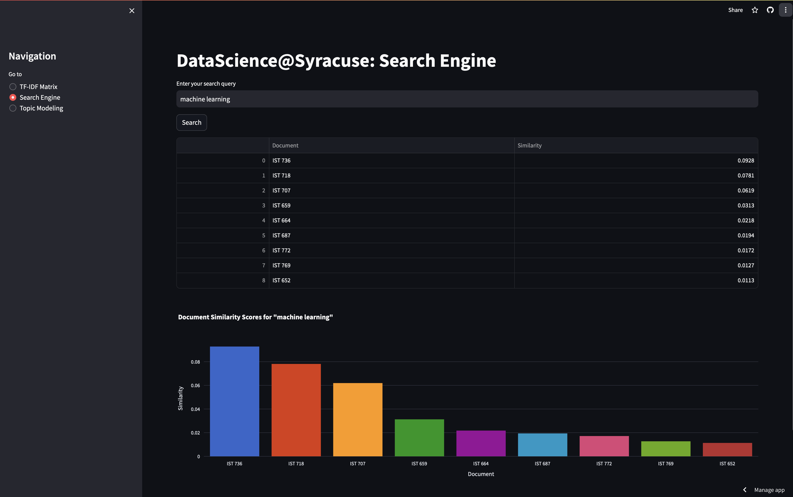
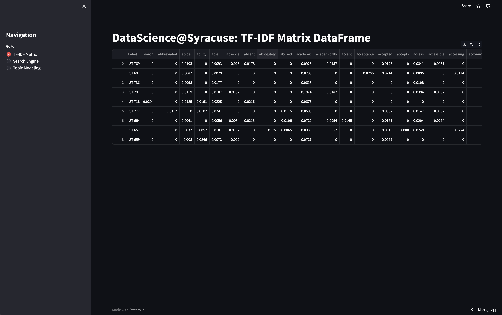

# IST 736 Text Mining Project

Welcome to the repository for the Text Mining project, a component of the IST 736 course at Syracuse University's Master of Science in Applied Data Science program. This project leverages advanced data processing, natural language processing, and text mining techniques to provide insightful analysis and interactive features around a specific text corpus. The text corpus consists of publicly available syllabi that were converted from PDF to text files for analysis.

## Features

The project encompasses several key functionalities designed to enhance the understanding and accessibility of the text corpus:

- **TF-IDF Matrix Data Frame:** Generates a comprehensive TF-IDF (Term Frequency-Inverse Document Frequency) matrix, highlighting the significance of words within the documents of the corpus.
- **Document Similarity Search:** Implements a search interface that allows users to input terms and retrieves documents most similar to the query, facilitating deeper exploration of the corpus.
- **Dynamic Topic Modeling:** Offers an interactive topic modeling feature where users can specify the number of topics to discover underlying themes within the corpus.

## Streamlit Application

To provide a user-friendly and interactive experience, a Streamlit application has been developed. This web application brings the project's features to life, allowing for real-time interaction and exploration.

Access the Streamlit app here: [https://ist736-syracuse.streamlit.app](https://ist736-syracuse.streamlit.app)

## Streamlit Application Images





## Getting Started

To run this project locally, ensure you have Python and Streamlit installed. Clone this repository, navigate to the project directory, and execute the Streamlit application:

```bash
git clone -b master https://github.com/matthewpergolski/IST_736.git
cd IST_736
streamlit run scripts/app.py
